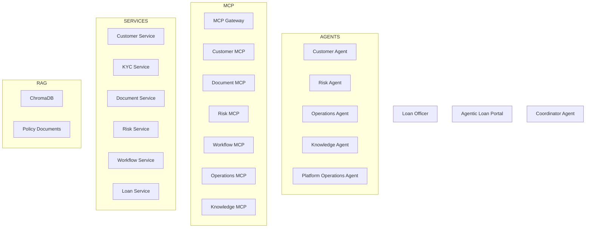

# BFSI Intelligent Loan Onboarding Copilot
## Enterprise Agentic AI POC Specification

### Version
1.0

### Objective
Build a complete Agentic AI Proof-of-Concept for Commercial Loan Onboarding in Banking.

The platform must demonstrate:
- Multi-Agent Collaboration
- MCP Gateway Pattern
- MCP Tool Discovery
- Deterministic Business Tools
- Spring Boot Microservices
- Human-in-the-Loop Approvals
- ChromaDB-based RAG
- MCP-based Backend Integration
- Enterprise Observability
- Auditability

The architecture should be deployable locally using:
- Docker Desktop
- Kubernetes (Optional)
- Ollama
- ChromaDB
- Python MCP Servers
- Spring Boot Services
- React UI

## Business Scenario
ABC Logistics applies for a commercial loan.

Customer: ABC Logistics
Loan Type: Working Capital
Amount: $2,500,000
Purpose: Fleet Expansion

## High-Level Architecture

## Technology Stack
- React / NextJS / Tailwind / Material UI
- Python LangGraph or CrewAI
- FastMCP
- Ollama (Qwen 3 / Mistral)
- ChromaDB
- Spring Boot Microservices

## Spring Boot Microservices
1. Customer Service
2. KYC Service
3. Document Service
4. Risk Service
5. Workflow Service
6. Loan Service

## MCP Gateway Responsibilities
- Tool Discovery
- Tool Registration
- Authentication
- Authorization
- Auditing
- Metrics
- Routing

## Agents
### Coordinator Agent
- Intent Classification
- Task Distribution
- Result Aggregation
- Approval Workflow Management

### Customer Agent
- Customer Profile Intelligence

### Risk Agent
- Credit & Risk Analysis

### Operations Agent
- Workflow Monitoring

### Knowledge Agent
- Policy & SOP Retrieval via ChromaDB

### Platform Operations Agent
- System Diagnostics

## UI Screens
1. Loan Operations Dashboard
2. Agent Chat
3. Agent Activity Timeline
4. MCP Activity Panel
5. Knowledge Evidence Panel
6. Observability Dashboard

## Deliverables
- React UI
- Coordinator Agent
- Five Domain Agents
- MCP Gateway
- Six MCP Servers
- Six Spring Boot Microservices
- ChromaDB Configuration
- Sample Banking Data
- Docker Compose
- Kubernetes Manifests
- Test Suite
- Demo Scripts
- Architecture Documentation

## Success Criteria
- Multi-Agent Architecture
- MCP Gateway Pattern
- Deterministic MCP Tools
- Spring Boot Backend Services
- ChromaDB-based RAG
- Human-in-the-Loop Governance
- Enterprise Auditability
- BFSI Business Relevance

## POC Tagline
Enterprise Agentic AI Commercial Loan Onboarding Copilot combining AI agents, MCP-based enterprise tool access, Spring Boot microservices, ChromaDB-powered knowledge retrieval, and governed decision making.
