# BFSI Intelligent Loan Onboarding Copilot
## Enterprise Agentic AI POC Specification

### Version
2.0

### Objective
Build a complete Agentic AI Proof-of-Concept for Commercial Loan Onboarding in Banking.

The platform must demonstrate:
- Multi-Agent Collaboration
- MCP Gateway Pattern
- MCP Tool Discovery
- Deterministic Business Tools
- Spring Boot Microservices
- Human-in-the-Loop Approvals
- ChromaDB-based RAG
- MCP-based Backend Integration
- Enterprise Observability
- Auditability

The architecture is deployable on any Linux VM or Docker Desktop using:
- Docker Compose
- Ollama (host or containerised)
- Python MCP Servers
- Spring Boot Microservices
- Static HTML/JS UI served by the Agent Server

## Business Scenario
ABC Logistics applies for a commercial loan.

Customer: ABC Logistics
Loan Type: Working Capital
Amount: $2,500,000
Purpose: Fleet Expansion

## High-Level Architecture

```mermaid
flowchart TB
    USER["Loan Officer / Browser"]
    OLLAMA["Ollama - Mistral 7B&#10;Host VM :11434"]

    subgraph DOCKER["Docker Compose Network"]

        subgraph AGENT_LAYER["Agent Layer :8096"]
            AS["Agent Server - FastAPI&#10;Serves UI + REST API"]
            subgraph LG["LangGraph Coordinator"]
                N1["1. classify&#10;intent + entities"]
                N2["2. select&#10;agent routing"]
                N3["3. execute&#10;gateway tool calls"]
                N4["4. hitl&#10;approval gate"]
                N5["5. synthesize&#10;format response"]
                N1 --> N2 --> N3 --> N4 --> N5
            end
        end

        subgraph GW_LAYER["Gateway Layer :9000"]
            GW["MCP Gateway&#10;Single Entry Point&#10;Routing / Audit / Discovery"]
        end

        subgraph MCP_LAYER["MCP Server Layer :9001 - 9007"]
            MCP1["customer-mcp :9001"]
            MCP2["kyc-mcp :9002"]
            MCP3["document-mcp :9003"]
            MCP4["risk-mcp :9004"]
            MCP5["workflow-mcp :9005"]
            MCP6["knowledge-mcp :9006"]
            MCP7["loan-mcp :9007"]
        end

        subgraph SVC_LAYER["Spring Boot Microservices :8081 - 8086"]
            SB1["Customer Service :8081"]
            SB2["KYC Service :8082"]
            SB3["Document Service :8083"]
            SB4["Risk Service :8084"]
            SB5["Workflow Service :8085"]
            SB6["Loan Service :8086"]
        end

        subgraph DB_LAYER["H2 In-Memory Databases"]
            DB1[(customerdb)]
            DB2[(kycdb)]
            DB3[(documentdb)]
            DB4[(riskdb)]
            DB5[(workflowdb)]
            DB6[(loandb)]
        end

    end

    USER -->|"HTTP :8096"| AS
    AS -->|"invoke / stream"| LG
    N1 -->|"POST /api/chat"| OLLAMA
    N5 -->|"POST /api/chat"| OLLAMA
    N3 -->|"POST /call/tool_name"| GW
    AS -.->|"GET /tools - health"| GW
    GW -->|"SSE"| MCP1
    GW -->|"SSE"| MCP2
    GW -->|"SSE"| MCP3
    GW -->|"SSE"| MCP4
    GW -->|"SSE"| MCP5
    GW -->|"SSE"| MCP6
    GW -->|"SSE"| MCP7
    MCP1 --> SB1
    MCP2 --> SB2
    MCP3 --> SB3
    MCP4 --> SB4
    MCP5 --> SB5
    MCP7 --> SB6
    SB1 --- DB1
    SB2 --- DB2
    SB3 --- DB3
    SB4 --- DB4
    SB5 --- DB5
    SB6 --- DB6
    AS -.->|"health"| SB1
    AS -.->|"health"| SB2
    AS -.->|"health"| SB3
    AS -.->|"health"| SB4
    AS -.->|"health"| SB5
    AS -.->|"health"| SB6
```



### Architecture Notes
- The **MCP Gateway** is the single entry point for all agent tool calls — the coordinator never connects to individual MCP servers directly
- **Ollama (Mistral 7B)** runs on the host VM; a keyword-based fallback classifier activates automatically if Ollama is unreachable
- All inter-service URLs are injected as Docker environment variables — no hardcoded `localhost` addresses
- The MCP Gateway maintains an in-memory **audit log** of every tool call (`GET /audit`)
- Spring Boot services use **H2 in-memory databases** seeded with sample BFSI data at startup

## Technology Stack

| Layer | Technology |
|---|---|
| UI | Static HTML / CSS / JavaScript (served by Agent Server) |
| Agent Orchestration | Python LangGraph (5-node DAG) |
| LLM | Ollama — Mistral 7B (host VM) with keyword-based fallback |
| Agent Server | Python FastAPI with SSE streaming |
| MCP Gateway | Python FastAPI — routing, discovery, audit log |
| MCP Servers | Python FastMCP — 7 domain servers (SSE transport) |
| Microservices | Java 17 · Spring Boot 3 · eclipse-temurin Alpine |
| Databases | H2 In-Memory (seeded via data.sql per service) |
| Containerisation | Docker Compose — all services on shared bridge network |

## Spring Boot Microservices
1. Customer Service
2. KYC Service
3. Document Service
4. Risk Service
5. Workflow Service
6. Loan Service

## MCP Gateway

The MCP Gateway (`gateway_server.py`, FastAPI `:9000`) is the **single entry point** for all agent tool calls.

| Endpoint | Purpose |
|---|---|
| `POST /call/{tool_name}` | Route a tool call to the correct domain MCP server by `domain` hint |
| `GET /tools` | Discover and aggregate all tools from all 7 MCP servers |
| `GET /tools/{domain}` | List tools for a specific domain |
| `GET /audit` | Return the in-memory audit log of all tool calls with timing and status |
| `GET /servers` | List all registered MCP servers and their URLs |
| `GET /health` | Gateway health check |

All MCP server URLs are injected via environment variables — adding a new MCP server requires only updating `docker-compose.yml` and `gateway_server.py`.

## Agentic Pipeline

The coordinator is implemented as a **single LangGraph DAG** with five nodes:

| Node | Role |
|---|---|
| **① classify** | Classifies user intent into one of 10 categories and extracts entities (customer\_id, loan\_id, name) using Ollama. Falls back to a keyword-based rule classifier if Ollama is unreachable |
| **② select** | Maps intent to a list of domain agents via `INTENT_AGENT_MAP` (e.g. `loan_status → [loan, workflow]`) |
| **③ execute** | For each selected agent, calls `POST /call/{tool}` on the MCP Gateway with `{domain, arguments}` — the gateway routes to the correct MCP server |
| **④ hitl** | Human-in-the-Loop interrupt gate — suspends the graph and awaits explicit approval for high-risk actions (e.g. loan disbursement) |
| **⑤ synthesize** | For policy queries: streams an LLM answer via Ollama. For data queries: formats results into structured markdown tables using `_fmt()` |

### Intent → Agent Routing

| Intent | Agents Selected |
|---|---|
| `customer_inquiry` | customer |
| `loan_status` | loan, workflow |
| `kyc_status` | kyc, customer |
| `document_check` | document |
| `risk_assessment` | risk, customer |
| `policy_question` | knowledge |
| `approval_request` | workflow, risk |
| `full_onboarding` | customer, kyc, document, risk, workflow, loan |
| `system_health` | platform |
| `general` | customer, loan |

## UI Screens
1. Loan Operations Dashboard
2. Agent Chat
3. Agent Activity Timeline
4. MCP Activity Panel
5. Knowledge Evidence Panel
6. Observability Dashboard

## Deliverables

| Deliverable | Status |
|---|---|
| Static HTML/JS Loan Portal UI | ✅ Implemented |
| LangGraph Coordinator Agent (5-node DAG) | ✅ Implemented |
| MCP Gateway (routing, discovery, audit) | ✅ Implemented |
| 7 Domain MCP Servers | ✅ Implemented |
| 6 Spring Boot Microservices | ✅ Implemented |
| H2 In-Memory Databases with seed data | ✅ Implemented |
| Docker Compose (full stack) | ✅ Implemented |
| Ollama keyword-based fallback classifier | ✅ Implemented |
| Human-in-the-Loop approval workflow | ✅ Implemented |
| Architecture Documentation | ✅ This document |

## Success Criteria
- Multi-Agent Architecture
- MCP Gateway Pattern
- Deterministic MCP Tools
- Spring Boot Backend Services
- ChromaDB-based RAG
- Human-in-the-Loop Governance
- Enterprise Auditability
- BFSI Business Relevance

## Deployment

```bash
# Start the full stack
docker compose up --build -d

# Access the UI
open http://<vm-ip>:8096

# View MCP Gateway audit log
curl http://localhost:9000/audit

# View all discovered tools
curl http://localhost:9000/tools
```

> **Note:** Ollama (Mistral 7B) must be running on the host VM with `OLLAMA_HOST=0.0.0.0` so Docker containers can reach it via `host.docker.internal:11434`. Spring Boot services take ~90 seconds to pass health checks on first start.

## POC Tagline
Enterprise Agentic AI Commercial Loan Onboarding Copilot — combining a LangGraph 5-node coordinator, MCP Gateway pattern for unified tool access, Spring Boot microservices, and governed Human-in-the-Loop decision making.
